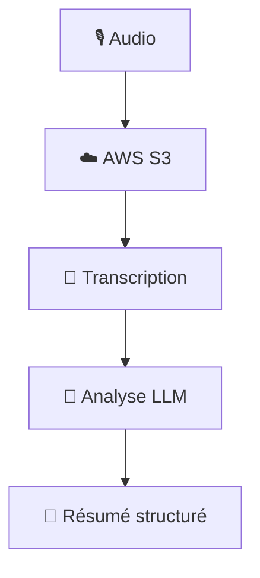

# 📝AnamnesIA🤖
### *Simplifier et automatiser la documentation médicale en quelques clics*

## Description du projet

AnamnesIA est une solution conçue pour simplifier le quotidien des professionnels de santé, en particulier les kinésithérapeutes. Ce projet vise à automatiser la création d'un document d'anamnèse à partir de l'enregistrement audio de la première consultation. Grâce à l'utilisation d'AWS Transcribe pour la transcription, de modèles de langage avancés d'OpenAI et de LangChain pour la personnalisation des résumés, AnamnesIA permet de générer une synthèse claire et professionnelle, tout en offrant la possibilité de modifier les templates selon les besoins.

Le projet s'appuie sur un stack technologique moderne comprenant Python comme langage principal, AWS Transcribe pour la reconnaissance vocale de haute qualité, OpenAI API pour l'utilisation de modèles de langage avancés (GPT), et LangChain pour structurer les interactions avec ces modèles.

## Workflow

<div style="display: flex; justify-content: flex-start; align-items: flex-start; gap: 15px;">

<div style="width: 15%;">
  

</div>
<div style="width: 50%;">
  <ol>
    <li><strong>Enregistrement de la conversation</strong><br>
        La conversation entre le patient et le praticien est enregistrée sous forme de fichier audio.
    </li>
    <li><strong>Téléchargement sur AWS S3</strong><br>
        Le fichier audio est téléchargé sur un bucket S3 pour être traité par les services AWS.
    </li>
    <li><strong>Transcription de la conversation avec AWS Transcribe</strong><br>
        Le fichier audio est transcrit en texte grâce à AWS Transcribe, qui fournit une transcription précise et rapide.
    </li>
    <li><strong>Analyse avec un LLM</strong><br>
        Le texte transcrit est analysé à l'aide des modèles de langage d'OpenAI, en utilisant LangChain pour appliquer un template modifiable. Cela permet de générer un résumé structuré ou un dictionnaire adapté aux besoins spécifiques.
    </li>
  </ol>
</div></div>

## Structure du projet

```
AnamnesIA/
├── data/               
│   ├── transcription.txt       # Exemple de transcription d'une consultation (douleur bas du dos)
│   ├── transcription2.txt      # Exemple de transcription d'une consultation (douleur genou)
│   ├── template.txt            # Template pour la génération du résumé structuré
│   ├── transcription-job-*.json # Fichiers JSON bruts générés par AWS Transcribe
│   ├── conversation2.wav       # Fichier audio de démonstration (conversation fictive générée par IA)              
├── src/
│   ├── utils/          
│   │   ├── generate_pdf.py     # Génération de PDF à partir des données structurées
│   │   ├── utils.py            # Fonctions utilitaires pour AWS et le traitement audio
│   │   ├── openai_utils.py     # Interface avec l'API OpenAI pour l'analyse
│   │   ├── anamnese_synthese.py # Logique de synthèse d'anamnèse
├── requirements.txt            # Dépendances du projet
├── demo_anamnesia.ipynb        # Notebook de test pour la démonstration du workflow complet
└── README.md                   # Documentation du projet
```

## Test et démonstration

Pour faciliter les tests et démos du système, un notebook Jupyter `demo_anamnesia.ipynb` a été créé. Ce notebook permet de tester le code en parcourant toutes les étapes du workflow.

[Accéder au notebook de démonstration](demo_anamnesia.ipynb)

Les fichiers présents dans le dossier `data/` sont prévus pour tester les différentes étapes du processus:
- Les fichiers `transcription.txt` et `transcription2.txt` sont des exemples de conversations transcrites générées par IA
- Le fichier `transcription-job-*.json` est une réponse réelle d'AWS Transcribe, permettant de tester l'intégration avec ce service
- Le fichier `conversation2.wav` est un exemple de conversation générée par IA pour démontrer le processus complet

Ces fichiers de test permettent de valider le fonctionnement du système sans avoir besoin d'enregistrer de nouvelles conversations. L'utilisation de données générées par IA présente l'avantage de ne poser aucun problème relatif à la protection des données personnelles ou à la confidentialité des informations médicales.

## Licence

Ce projet est sous licence MIT - voir le fichier [LICENSE](LICENSE) pour plus de détails.


